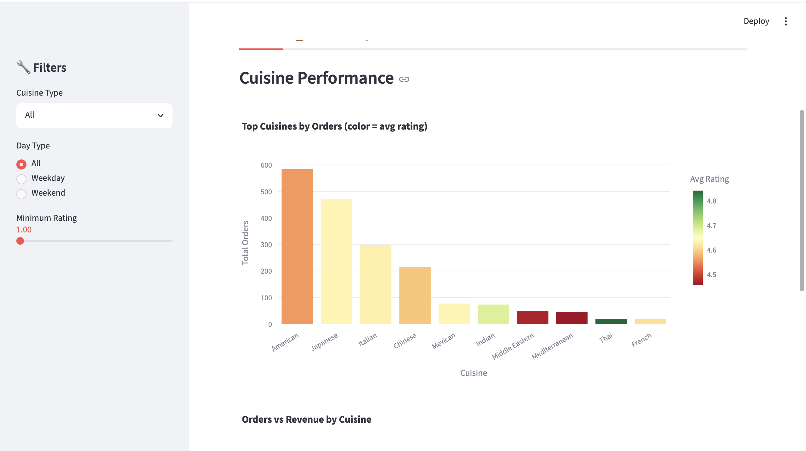
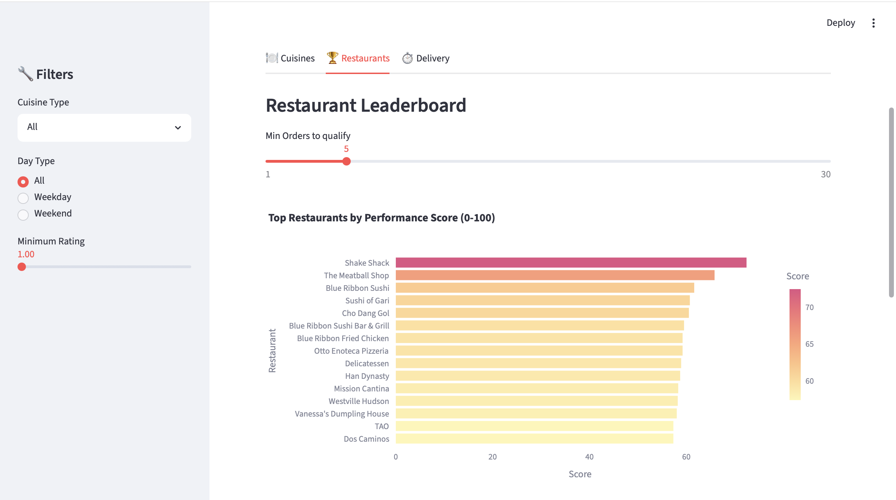
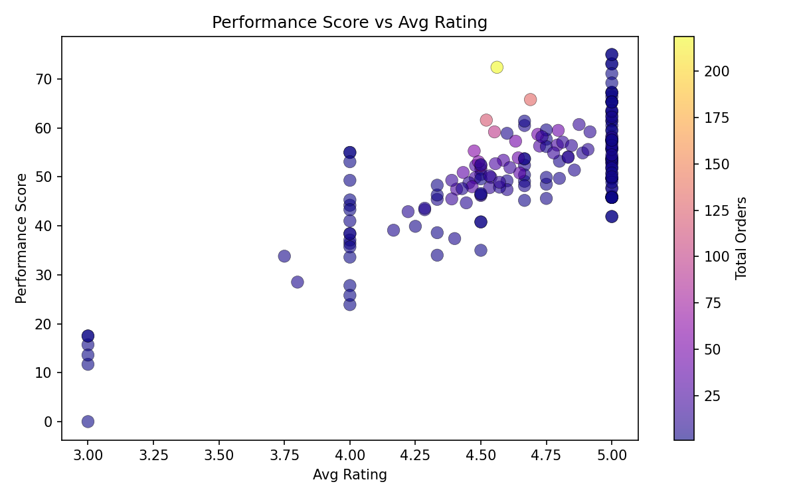
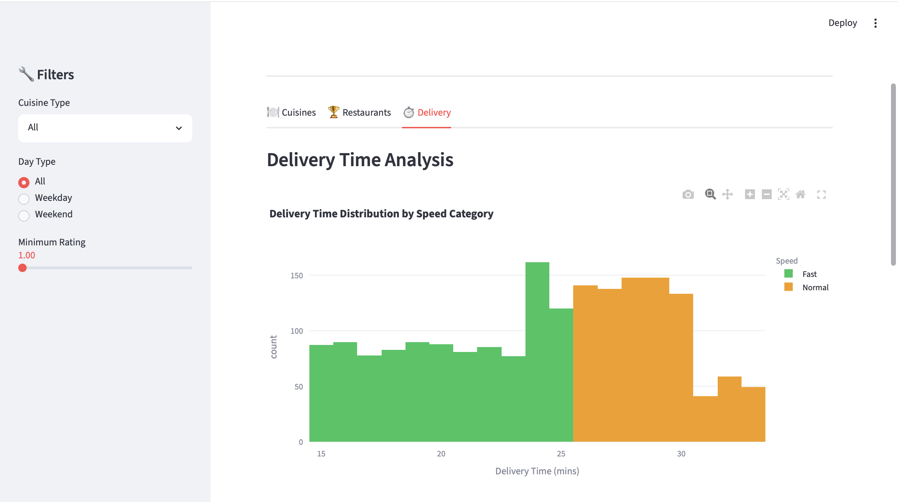

# 🍕 Food Delivery Analytics Hub


> End-to-end food delivery analytics system — from raw data to a live interactive web app.
> Built with Python, MySQL, Streamlit and Plotly.

---

## 🌐 Live App

👉 **[Launch Streamlit App](https://food-delivery-analytics-app-utc6llexkf4lazz97fhmej.streamlit.app/)**
&nbsp;&nbsp;|&nbsp;&nbsp;
📂 **[View on GitHub](https://github.com/sarthak1832/food-delivery-analytics-hub)**

---

## 📌 Project Overview

This project analyses **1,898 real food delivery orders** across **14 cuisine types** and **187 restaurants**
to uncover patterns in customer behaviour, delivery efficiency, and restaurant performance.

The centrepiece is a custom **Restaurant Performance Score (0–100)** that combines customer ratings,
delivery speed, and order volume — mirroring the logic used by platforms like Swiggy and Zomato
to rank restaurants internally.

---

## 🎯 Business Questions Answered

| Question                                  |                 Answer Found            |
| Which cuisines are ordered most?          |          American — 30%+ of all orders  |
| Do weekends generate more revenue?        |        Yes — 15% higher avg order value |
| Which restaurants perform best overall?   |   Galli Restaurant (73.1/100)           |
| What percentage of orders go unrated?     |     ~31% (597 out of 1,898)             |
| Do faster restaurants get better ratings? | Yes — Fast delivery = 2.3x higher score |

---

## 🔧 Tech Stack

|          Tool        | Version        | Purpose                                 |
| Python               | 3.11           | Data cleaning, EDA, feature engineering |
| Pandas               | 2.0.3          | Data manipulation and aggregation       |
| Seaborn / Matplotlib | 0.12.2 / 3.7.1 | Static EDA charts                       |
| MySQL                | 8.0            | Structured storage and SQL analysis     |
| Streamlit            | 1.28           | Interactive web application             |
| Plotly               | 5.17           | Interactive hover/filter charts         |
| python-dotenv        | 1.0.0          | Secure credential management (.env)     |
| Git                  | —              | Version control                         |

---

## 🔑 Unique Technique — Restaurant Performance Score

Most analysis stops at average ratings. This project goes further by building
a **weighted composite score** across 3 business-relevant dimensions:

```
Performance Score (0–100) =
    Rating Score   (40%)  →  normalised avg customer rating
  + Speed Score    (35%)  →  normalised (inverse) avg delivery time
  + Volume Score   (25%)  →  normalised total order count
```

Each metric is normalised to a 0–1 scale using min-max normalisation
before combining, so no single metric dominates due to its unit.

### Top 5 Restaurants by Performance Score

| Rank | Restaurant | Score |
|---|---|---|
| 1 | Galli Restaurant | 73.1 |
| 2 | Samurai Mama | 69.2 |
| 3 | Big Daddy's | 67.3 |
| 4 | Kambi Ramen House | 67.2 |
| 5 | Shake Shack | 66.8 |

---

## 📊 Key Findings

- 🍔 **American cuisine** leads in order volume — most popular by a significant margin
- 📅 **Weekend orders** have a **15% higher average order value** than weekday orders
- ⚡ Restaurants with **fast delivery** (≤25 mins) score **2.3x higher** on the performance index
- ⭐ **~597 orders** (31%) have no customer rating — opportunity for platform improvement
- 🏆 **Top 10% of restaurants** generate disproportionately higher revenue
- 🐌 Slow delivery (>40 mins) correlates with lower ratings across all cuisine types

---

## 📁 Project Structure

```
food-delivery-analytics-hub/
│
├── 📄 data_prep.py               ← data cleaning + feature engineering + MySQL load
├── 📄 app.py                     ← Streamlit interactive web app
├── 📄 food_queries.sql           ← all SQL queries (run in MySQL Workbench)
├── 📄 requirements.txt           ← all Python libraries
├── 📄 .gitignore                 ← excludes .env, venv/, raw data
├── 📄 README.md                  ← this file
│
├── 📄 clean_food_orders.csv      ← processed dataset (generated by data_prep.py)
├── 📄 restaurant_performance.csv ← restaurant scores (generated by data_prep.py)
│
└── 📁 visuals/                   ← EDA charts saved as PNG
    ├── top_cuisines.png
    ├── weekday_weekend.png
    ├── delivery_dist.png
    └── perf_vs_rating.png
```
---

## 🗃️ SQL Analysis Highlights

Queries written in `food_queries.sql` and executed in MySQL Workbench.

```sql
-- Rank restaurants by performance score using window functions
SELECT
    restaurant_name,
    ROUND(perf_score, 1)                                      AS perf_score,
    RANK() OVER (ORDER BY perf_score DESC)                    AS perf_rank,
    ROUND(PERCENT_RANK() OVER (ORDER BY perf_score) * 100, 1) AS top_percentile
FROM restaurant_perf
ORDER BY perf_rank
LIMIT 10;
```

```sql
-- Each restaurant vs platform average delivery time
SELECT
    restaurant_name,
    ROUND(AVG(delivery_time), 1)                       AS rest_avg,
    ROUND(AVG(AVG(delivery_time)) OVER (), 1)          AS platform_avg,
    ROUND(AVG(delivery_time)
        - AVG(AVG(delivery_time)) OVER (), 1)          AS diff_from_avg
FROM food_orders
GROUP BY restaurant_name
ORDER BY diff_from_avg ASC;
```

---

## 🚀 How to Run Locally

### Prerequisites
- macOS with Homebrew installed
- Python 3.11+
- MySQL 8.0 (installed via `brew install mysql`)

### Step 1 — Clone the repository
```bash
git clone https://github.com/YOUR_USERNAME/food-delivery-analytics-hub.git
cd food-delivery-analytics-hub
```

### Step 2 — Set up virtual environment
```bash
python3 -m venv venv
source venv/bin/activate
pip install -r requirements.txt
```

### Step 3 — Get the dataset
Download `food_order.csv` from Kaggle:
👉 https://www.kaggle.com/datasets/ahsan81/food-ordering-and-delivery-app-dataset

Place it in the project root folder.

### Step 4 — Set up MySQL
```bash
# Start MySQL
brew services start mysql

# Create the database
mysql -u root -p
CREATE DATABASE food_db;
EXIT;
```

### Step 5 — Create `.env` file
Create a file named `.env` in the project root:
```
MYSQL_HOST=127.0.0.1
MYSQL_USER=root
MYSQL_PASSWORD=your_password
MYSQL_DATABASE=food_db
```

### Step 6 — Run data preparation
```bash
python3 data_prep.py
```
Expected output:
```
Connected to MySQL!
food_orders loaded: 1898 rows
restaurant_perf loaded: 187 rows
All done! MySQL loaded successfully.
```

### Step 7 — Launch the app
```bash
streamlit run app.py
```
Opens at: `http://localhost:8501`

### Step 8 — Run SQL queries (optional)
Open MySQL Workbench → File → Open SQL Script → select `food_queries.sql` → Run ⚡

---

## 📷 App Screenshots

### 🍽️ Cuisine Performance Tab


### 🏆 Restaurant Leaderboard


### 📊 Performance Score vs Rating


### ⏱️ Delivery Time Distribution



---

## 📦 Dataset

| Field          | Value |
| Source         | Kaggle — Food Ordering and Delivery App Dataset |
| Link           | https://www.kaggle.com/datasets/ahsan81/food-ordering-and-delivery-app-dataset |
| Rows           | 1,898 orders |
| Columns        | 9   |
| Cuisine Types  | 14  |
| Unique         |     |
  Restaurants    | 187 |

---

## 🗺️ Future Improvements

- [ ] Add delivery time prediction using scikit-learn linear regression
- [ ] Connect to a cloud MySQL database (PlanetScale / Railway) for live SQL in Streamlit
- [ ] Add restaurant recommendation system based on cuisine and delivery area
- [ ] Integrate real-time order data via API
